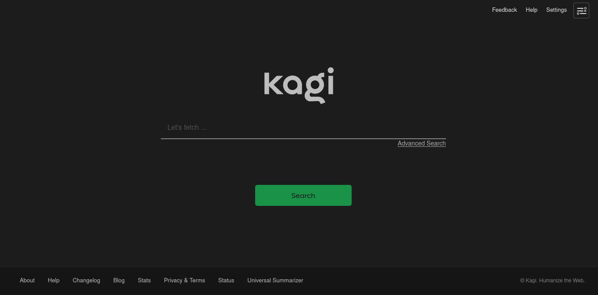
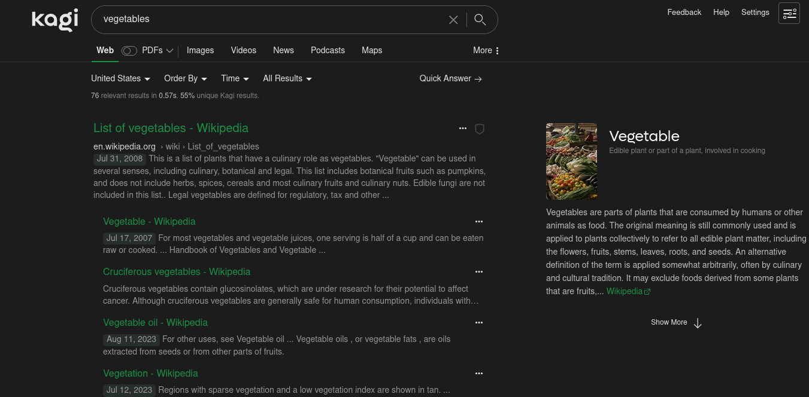

Change the default colors by modifying the very first section of the CSS. (See <a href="./other-colors.css">other-colors.css</a> for examples)

Make sure dark mode is on and the theme is set to 'Moon Dark' for the custom CSS to work.

<b>Previews:</b>

